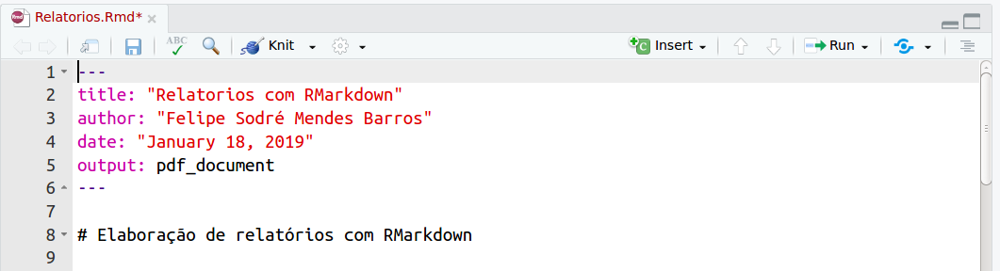
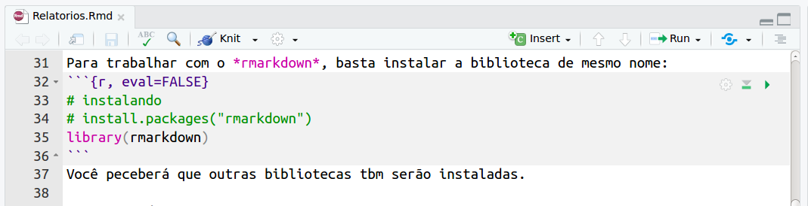
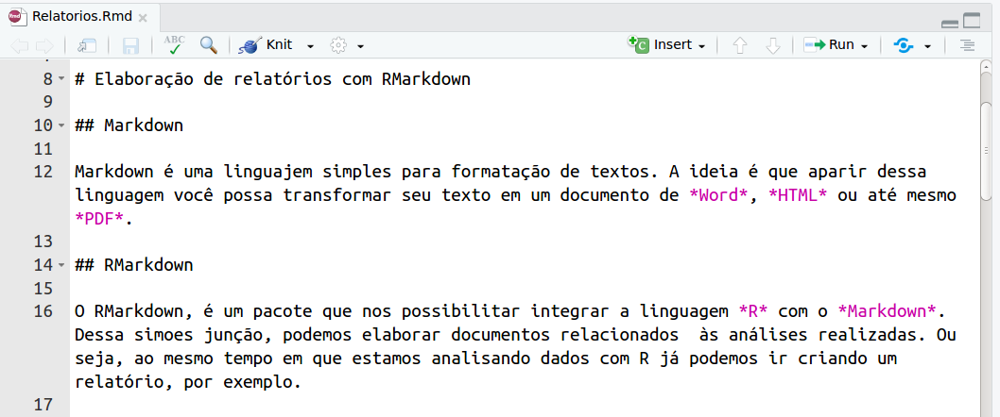
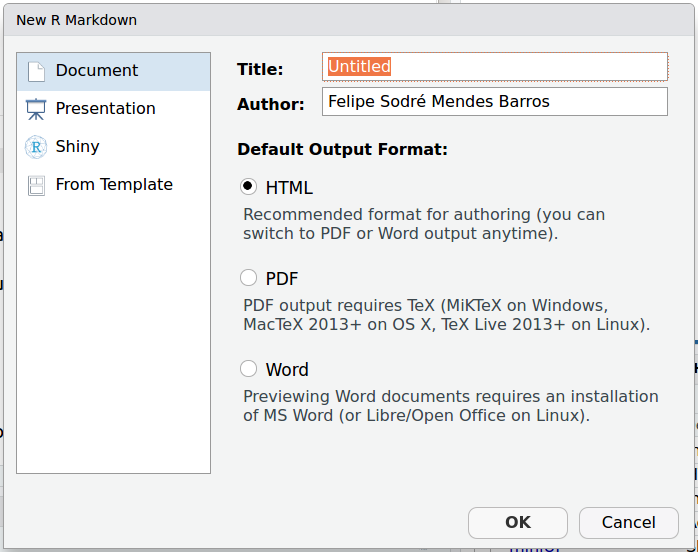
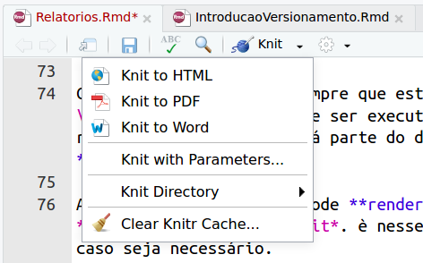

# Antes de começar  {#AntesComecar}

Alguns pontos básicos:  
  
- A extensão do arquivo é *.Rmd* (*R* + *md* [*Markdown*]), independente do tipo de documento que se pretende criar (*HTML*, *PDF* ou *Doc*);  
- Ao criar um documento *Rmd* novo, o mesmo terá sempre um exemplo (conteúdo) básico;  
- Todo documento *Rmd* deverá ter três elementos:
  - Cabeçalho de configuração *Markdown* (começa e termina com  ```---``` ) ( \autoref{configRmd} );  

{ width=50%}  

  - Pedaços de código (*code chunk*) (começa e terminam com   ``` ``` ``` ) ( \autoref{codigor} );  

{ width=50%}  

- O texto em sí, usando a linguajem *Markdown* para definição de título, negrito, etc ( \autoref{txtrmd} );  

{ width=50% }  

Uma vez criado o documento com o texto e as análises feitas, o mesmo será **renderizado**  e transformado em um documento no formato solicitado.  

> **Infelizmente alguns recursos mostrados nesse documento funcionam apenas para a renderização em PDF;**  

# Criação do documento  {#CriacaoDoc}  

Ao criar um novo documento *Rmd*, você poderá escolher entre *HTML*, *PDF* ou *Word* ( \autoref{NewDoc} ). Escolha o que for de sua preferencia e **não se preocupe pois é possível mudar o tipo de documento**, sempre que se fizer pertinente (também veremos isso mais à frente na seção \ref{ExI} ).  

{ width=50% }  

Cada trecho de código, sempre que estiverem dentro da área delimitada para codigo r ( \autoref{codigor} ),  pode ser executado para se ter conhecimento de seu resultado. O resultado apresentado fará parte do documento final, uma vez que o mesmo seja **renderizado**.  

A qualquer momento você pode **renderizar** o documento o transofmrado em *HTML*, *PDF* ou *Doc*, usando o botão *Knit*. E nesse menu que podemos mudar o formato final do documento, caso seja necessário.  

### Exercício I (alterando formato *output*)  {#ExI}
  
1. Criar um documento *Rmarkdown* e executar-lo sem modificar nada;  
    * Perceba como está a área de configuração do seu *.Rmd*;  
1. Execute-o novamente, mas dessa vez alterando o formato final pelo menu do *Knit* ( \autoref{KnitMenu} );  
    - Veja novamente a área de configuração do *Rmd*. O que mudou? 

{ width=50% }  

# Sintaxe Markdown  {#SintaxeMarkdown}

Como mencionado anteriormente, ao usar um arquivo *\*.Rmd* temos a possibilidade de mesclar a linguagem de formatação de texto *Markdown* com códigos *R*. Vamos começar entendendo a sintaxe *Markdown*.  

A sintaxe *Markdown* é toda relacionada à **formatação de texto**. Como vocês puderam observar ao *renderizar* o documento padrão (exercício anterior), o símbolo \#\# define que naquela linha estará o texto com um título de segunda ordem no nível hierarquico, já que o título de primeira ordem seria definido com apenas um \#. A hierarquia de títulos é, portanto, definida pela sequência de \#. Por exemplo, na figura \autoref{txtrmd}:  
  
* O texto "Elaboração de relatórios com RMarkdown" será o título do documento, por possuir apenas um \#.
* Logo em seguida, será incluído um título de segunda hierarquia (subtítulo) com texto "Markdown" (já que o mesmo é precedido por dois \#).  
* A sequencia segue até satisfazer o nível hierarquico de títulos do seu documento;  

Uma coisa bem legal desse sistema de formatação de texto é que, **por ser declarativo por texto (ou comando em sintaxe *Markdown*), fica fácil colaborar com outras pessoas sem perder as configurações**, além de deixar claro a estrutura do texto. Isso desde que sempre se edite o arquivo *Rmd.* Caso contrário isso dependerá dos conhecimentos dos usuários de softwares de eedição de texto, como o *MS Word*.  

Outros elementos importantes para formatação de texto são:  
  
* **Negrito**: Para colocar uma palavra ou frase em negrito, basta usar dois asterístico (\*\*)  para iniciar o trecho e dois asterístico para fechar o texto a ser enfatizado (ex.: \*\*trecho em negrito\*\*).  
* *Itálico*: Similar ao **negrito**, mas usa-se apenas um asterístico no início e outro no fim (ex.: \*trecho em italico\*).  
* ~~riscado~~: Basta inserir dois tis (\~\~) ao início e outros dois ao fim do trecho a ser riscado (ex.: \~\~trecho riscado\~\~);  

**Pontos importantes**:  

> Os elementos de formatação de texto, como **negrito**, *italico*, ~~riscado~~, dentre outros, deverão ser seguidos por texto, sem espaço entre o elemento de formatação e o texto a ser formatado. Contudo, já com relação aos títulos, é necessário dar espaço entre o \# e o texto a receber a formatação de titulo.  

### Exercício II (Sintaxe markdown)  
  
1. Colocar todo o primeiro parágrado como riscado;
1. Colocar algumas paravras em **negrito**;  
1. Colocar outras palavras em *intálico*;  
1. Alterar a hierarquia dos títulos;  
1. Cria um novo título de primeira hierarquia;  
1. Renderize em formato *PDF*. Analise o indice do documento. Obedeceu a hierarquia definida?  
1. Renderize em formato *.doc*. Analise o indice do documento. Obedeceu a hierarquia definida?  

# Trabalhando com códigos R  {#TrechoR}

Já vimos como identificar e inserir código *R* em nosso documento de texto. Vimos que existe um padrão para isso. Mas vamos a alguns detalhes ( \autoref{DetalhesR} ):  


Após inserir o padrão que delimita um trecho de código *R* em nosso documento, vemos que dentro das chaves temos vários elementos... Vamos explorá-los!  

## *labels*  {#RLabels}

Na \autoref{DetalhesR} vemos, logo após a linguagem que estamos trabalhando (*r*, neste caso), um texto: **cars**, no primeiro trecho de código; e **pressure**, no segundo trecho de código. Esse texto é uma *label* que **podemos** criar (**opcional**) para cada trecho de código. Ele serve para facilitar na **compilação** do documento final. Caso algum trecho de código apresente erro, o erro e a *label* serão informados, o que facilitará nossa vida quando estivermos trabalhando com um documento com vários trechos de código diferentes.  

Alguns detalhes com relação a essa *label*:  
  
1. Não podem conter espaço;
1. Quando não informada, será criada uma label padrão *unnamed-chunk-1*. O número final é sequencial em referencia à sequencias aos quais os trechos de código aparecem sem *label*.  
  
# *configurações do **code chunk** *  {#codeChunkConf}

Ainda tendo como referência a \autoref{DetalhesR}, vemos no segundo trecho de código a opção *echo=FALSE* logo após o texto da *label* e separado por vírgula. Se trata de uma das **várias** opções de configuração desse trecho de código.  

Como são muitas opções, vamos trabalhar com apenas quatro delas:
  
1. *echo*: Dever conter valor *TRUE/FALSE* e define se o texto do código inserido deverá constar no texto do documento. Por padrão está definida como *TRUE*, já que se usa muito o *RMarkdown* para fins didáticos, onde se tem interesse de motrar o código usado e o resultado do código.  
1. *eval*: Também definido como *TRUE/FALSE*, define se o trecho de código deverá ser executado. Como padrão está definido como *TRUE*. Pode parecer estranho a existencia/necessidade dessa opção. Afinal, porque necessitaríamos um trecho de código se não for para executá-lo? Pense num exemplo: você está criando um documento mostrando como funciona o comando de instalação de bibliotecas ("install.packages(ggplot)", por exemplo). Se você não alterar o *eval* para *FALSE*, sempre que você *renderizar* seu documento ele fará a instalação da biblioteca. É o que queremos? Imagino que não...  
1. *include*: Definido por padrão como *TRUE*, define se o trecho de código, **que será executado** apresentará no texto do documento seus resultados, mensagens e avisos (*warnings*); Também parece sem sentido? Vamos a um exemplo: Queremos, em algum momento salvar um determinado aquivo em *.csv*. Mas não precisamos ter isso no exposto em nosso texto final, então podemos usar essa opção e, sem precisar mexer em várias opções (*hecho*, *warning*, etc) já desabilitar qualquer tipo de mensagem relacionado a essa tarefa ao mesmo tempo que grantimos que a mesma seja executada.  
1. *fig.width*: Vimos na \autoref{DetalhesR} que podemos inserir um gráfico direto ao nosso documento sem a necessidade de salva-lo como uma figura e depois inseri-lo ao texto. Contudo, como faríamos para ajustar o tamanho do gráfico? Para isso serve as opções *fig.width* e *fig.heigth*. Essas opções devem ser seguidas de um valor numérico (exemplo, *fig.width = 7*) representando o tamanho de largura/altura da figura em *inches*;  

# Inserir *plot*  {#InserirPlot}

Perceba que o segundo trecho de código do documento padrão é um simples comando ```plot(pressure)```. Isso, por sí só, faz com que o *plot* realizado seja incluído no documento final ao *renderizá-lo*.  

## Inserir legenda ao *plot*  {#InserirLegendaPlot}  

Um parâmetro de configuração, não mencionado na seção anterior ( \ref{codeChunkConf} ), mas que será fundamental, caso queira inserir uma selegenda ao seu gráfico é a opção `fig.cap`. Essa opção de configuração deverá receber a string (portanto, deverá estar entre aspas) a ser exibida como legenda.

**Exemplo**:  

```
\```{r, fig.cap="Gráfico de dispersão entre variável x e y."}
plot(c(1,2,3), c(3,2,1))
\```
```

**Resultado**:  
```{r, fig.cap="Gráfico de dispersão entre variável x e y.", fig.height=4, fig.width=4}
plot(c(1,2,3), c(3,2,1))
```  

Veremos mais opções de configuração dos gráficos na seção \ref{crossRef}  

### Exercício (opções de codigo R)  

1. No *Rmd* criando anteriormente, altere os parâmetros dos trechos de código. Quais são os resultados das alterações realizadas?  
1. Altere o gráfico usando *ggplot*;  
    * Perceba que há que carregar a biblioteca (incluí-lo no trecho de código).  

# *inline code*

Já vimos como inserir trechos de código no nosso texto. Uma coisa que não vimos é o chamado *inline code*, que é a possibilidade de escrever um codigo curto (de uma linha) e que terá seu resultado inserido na mesma posição e que se encontra o código.

Para usá-lo basta usar uma crase (``` ` ```) seguida pela definição da linguagem de programação a ser usada (meste caso, *r*) e posteriormente, o comando a ser executado. Exemplo: ``` ` r length( c(1, 2, 3, 4)) ` ```

Para que serve? Vamos imaginar que estamos escrevendo um artigo e precisamos dizer a quantidade de dados que usamos. Uma possibilidade (vou chamá-la de tradicional) seria consultar a quantidade de linhas ou o *length* de nossos dados no *R* e escrevê-lo posteriormente no nosso texto. Mas e se nosso dados mudarem? Teremos que fazer isso de novo. Aí é que entra o *inline code*.  

**Exemplo**:  

> Em nossa análise foi realizada a média de ``` ` r length( c(1, 2, 3, 4)) ` ``` valores numérico sorteados ao azar, cujo resultado foi de ``` ` r mean( c(1, 2, 3, 4)) ` ```;  

**Resultado**:  

> Em nossa análise foi realizada a média de `r length( c(1, 2, 3, 4)) ` valores numérico sorteados ao azar, cujo resultado foi de `r mean( c(1, 2, 3, 4)) `;  

# Inserindo tabela  

Outro elemento muito importante a ser inserido nos relatórios são as tabelas. Há algumas formas de adicionar os *dataframes* ou *tibles* ao nosso relatório de forma automática e configurada. Vamos usar o pacote `knitr`.  

## Knitir {#TableKnitr}  

Para adicionar nosso *dataframe* ao relatório, vamos usar a função `kable()`, do pacote `knitr`, da seguinte forma:  

**Exemplo**:  

```
\```{r InserindoTabela}
knitr::kable(head(mtcars))
\```
```  
  
**Resultado**:  
  
```{r InserindoTabela2, echo=FALSE}
knitr::kable(head(mtcars))
```

Incentivo a vocês a darem uma olhada no *help* da função `kable`, para identificarem os parâmetros de configuração que afetarão diretamente o *layout* final da tabela.  

* [pander](http://rapporter.github.io/pander/)  
* [xtable](https://cran.r-project.org/web/packages/xtable/index.html)  
* [comparativo](http://rapporter.github.io/pander/)  
  
### Adicionando titulo à tabela

**Exemplo**:  

```
\```{r}
knitr::kable(head(mtcars), caption="Analise dos carros.")
\```
```
  
**Resultado**:  

```{r, echo=FALSE}
knitr::kable(head(mtcars), caption="Analise dos carros.")
```

# Inserindo imagem  {#InserindoImagem}

Já vimos como inserir um gráfico gerado direto de um código *R*. Lembra? Isso foi na seção \ref{InserirPlot}. Mas sabemos bem que nem todas as imagens e figuras de nossos documentos e/ou artigos são provenientes do *R*. Então precisamos saber como inseri-las.  

Para fazer isso basta incluir o seguinte código ``` ```. A exclamação tem que se mantida. E dentro dos colchetes, podemos escrever a legenda da imagem, quando acharmos pertinente. **Veja a seção \ref{MarkdownConfig} para saber o que é preciso ser modificado na configuração do *Markdown* para que a legenda de imagens sejam apresentadas.** Não se preocupem... é uma linha que muda tudo!

Das maiores fontes de erro ao inserir imagens, antecipamos:  
  
* Caminho para imagem errado[^1];   
* Nome errado do arquivo;  
* Falta de parágrafo antes e depois de onde deverá ir a imagem [^2];  

[^1]: Só esse tema vale um capitulo... Mas em resumo, podemos usar um caminho relativo, que considera sempre a partir da pasta de trabalho atual (*Working Directory*); Ou caminho absoluto, que informará todas as pastas desde o diretório "raiz" (não recomendado!);  
[^2]: Isso faz parte de algumas coisas inexplicáveis do *Markdown*... As vezes precisamos dar espaço entre parágrafos para que alguns recursos funcionem. As vezes não. Nisso a experiencia ajuda bastante.  

## Forçando ordem de aparição das imagens

Se você chegou a inserir várias imagens no seu relatório, já deve ter se deparado com um comportamento estranho do *Rmarkdown* em colocar as imagens em posições diferentes da ordem inserid ano relatório. [Isso é normal e, na verdade tem a ver com LaTeX](https://bookdown.org/yihui/rmarkdown-cookbook/figure-placement.html). O *LaTeX* busca otimizar espaço e por isso é comum que algumas imagens estejam onde deveriam estar.
A noticia boa é que podemos resolver isso.

Basta adicionar ao cabeçalho o seguinte:

* `header-includes:` - Permite adicionar comando latex
* `\usepackage{float}` - Informa que usaremos o pacote 'float', necessário para o que queremos
* `\floatplacement{figure}{H}` - Informa que queremos o posicionamento das imagens no local ao qual ela é "chamada". `h` faz referência a "here".

```
header-includes:
- \usepackage{float}
- \floatplacement{figure}{H}
```
 
# Referência cruzada  {#crossRef}

Por referência cruzadas entendemos a possibilidade de referir-nos a imagens e seções de nosso documento no corpo de nosso texto, sem termos que nos preocupar com seus respectivos números, facilitando **muito** a edição e a manutenção de nossos textos. Isso pelo fato de ambos serem sempre atualizados segundo a ordem das figuras/seções a cada *renderização*.  

## De gráfico (*plot*)  

Vimos em \ref{InserirPlot} como inserir um gráfico (*plot*) em nosso documento, lembra?  

```
\```{r}
plot(c(1,2,3), c(3,2,1))
\```
```  

E vimos como iserir leganda a ele:  

```
\```{r, fig.cap="Gráfico de dispersão entre variável x e y.""}
plot(c(1,2,3), c(3,2,1))
\```
```  

Mas como usá-lo em referencia cruzada?  

Para criar referência cruzada com os gráficos criados através do *R*, precisaremos criar uma *label*. A *label*, assim como no caso dos *trechos de código* ( \ref{RLabels} ) deverão se um dientificador único e exclusivo para cada gráfico. Mas a *label* usada, não é a mesma que a do *code-chunk*. Por isso precisamos inserir dentro da *string* da configuração da legenda (`fig.cap`) o comando `\\label{LabelDoGrafico}` onde o texto dentro de chaves serão a *label* do gráfico.  

Por agora só criamos a *label* do gráfico. Para fazer a referência à esse gráfico em nosso texto, usaremos o comando `\ref{LabelDoGrafico}` onde quisermos referir-nos à figura.  

*Exemplo*:  
```
\```{r s, fig.cap = "\\label{fig:plotTest}Gráfico de dispersão entre as variáveis x e y."}
plot(c(1,2,3,4), c(1,2,3,4))
\```
```  

> Aqui farei referência à ```\ref{fig:plotTest}``` onde vemos o gráfico de dispersão entre as variáveis x e y.  

*Resultado*:  

```{r, fig.cap = "\\label{fig:plotTest}Gráfico de dispersão entre as variáveis x e y.", fig.height=4, fig.width=4}
plot(c(1,2,3,4), c(1,2,3,4))
```

> Aqui farei referência à figura \ref{fig:plotTest} onde vemos o gráfico de dispersão entre as variáveis x e y.


## De imagem  

Vimos na seção \ref{InserindoImagem} como inserir uma imagem. Lembra?  

``` ```  

Vimos ainda que podemos inserir uma legenda a essa figura. Lembra?  

``` ```  

Pois bem, se queremos fazer uma referencia a essa imagem usando a *ferramenta* de referência cruzada, basta, entre os colchetes, inserir uma *label* a essa mesma imagem: (``` \label{LabelDessaImagem}``` ). Assim como as *labels* dos trechos de código (conforme mencionado na seção \autoref{RLabels} ), elas deverão ser como um ID e não poderão se repetir em diferentes imagens:  

``` ```  

O que fizemos até agora foi criar uma *label* para a imagem que queremos referenciar em alguma parte do texto. Agora, para fazer a referencia a essa imagem, basta usar ``` \autoref{LabelDessaImagem} ```.  

**Exemplo**:  

> ```  ```  
> veja a ``` \autoref{LabelDessaImagem} ``` ela é muito legal a responde todas as questões científicas sobre a restauração!  

**Resultado**:  

{ width=50% }  

> veja a \autoref{SolucaoRestauracao} ela é muito legal a responde todas as questões científicas sobre a restauração!  

## De seção  

Quando quisermos fazer referencia a alguma seção (Título, subtítulo, ...), precisaremos criar uma *label* nessa seção, usando o *comando* ``` {#labelsecao} ```, para depois referenciá-la no texto usando ``` \ref{labelsecao} ```.  
Repare que, para criar a seção, devemos inserir \# antes do texto da *label*. E no comando ```\ref{}``` a label vai sem o \#. Outra observação importante, não use espaço nas *labels*!  

**Exemplo**:  

> Ver a seção `\ref{InserindoImagem}` para saber mais informações  

**Resultado**:  

> Ver a seção \ref{InserindoImagem} para saber mais informações 

## De tabela  

Assim como nos casos anteriores, precisaremos adicionar uma *label* à nossa tabela. Faremos isso adicionarndo `\\label{labelDaTabela}` **dentro da tring do título**. Estamos usando `\` duas vezes para que a mesma não seja confundida com o título. **Fique atento pois essa é uma fonte de erro bem comum**.  

**Exemplo**:  

```
\```{r}
knitr::kable(mtcars[1:3,1:3], align='c', caption="Analise dos carros. \\label{tabelamtcars} ")
\```
```
  
**Resultado**:  

```{r}
knitr::kable(mtcars[1:3,1:3], align='c', caption="Analise dos carros. \\label{tabelamtcars} ")
```

E, como você já deve imagina, para fazer referencia à tablea, basta usar `\autoref{labelDaTable}`

**Exemplo**:  

> Na `\autoref{tabelamtcars}` apresentamos todos os dados usados.  

**Resultado**:  

> Na \autoref{tabelamtcars} apresentamos todos os dados usados.  

# Nota de roda-pé

Para inserir nota de roda-pé é muito fácil, e há duas possibilidades para você escolher.  

## Primeira possibilidade  {#op1}

A primeira, que acredito ser a mais simples (mas não necessáriamente, mais organizada, no sentido textual) é inserindo `^[]` ao fim do trecho que deverá conter a nota, com o texto dentro dos colchetes. Exemplo: 
``` ^[aqui dentro vai o texto da nota] ```  

**Exemplo**:  

> Quando lhe disserem que você não consegue, lembre-se que os grandes heróis já ouviram isso e nunca desistiram ``` ^[Frase retirada de: https://www.mundodasmensagens.com/frases-efeito/] ```.  
 
**Resultado**:  

> Quando lhe disserem que você não consegue, lembre-se que os grandes heróis já ouviram isso e nunca desistiram ^[Frase retirada de: https://www.mundodasmensagens.com/frases-efeito/].  

Porque eu acho que talvez não seja, necessáriamento, a forma mais organizada? Pois imagine que você queira colocar uma nota de roda-pé ao fim de uma frase que está no meio de um parágrafo. Você terá no seu *Rmd* a nota de roda-pé no meio do parágrafo. E isso pode confundir a algumas pessoas ou dificultar a leitura do paragrafo inteiro (quando não renderizado, claro).  

Não deixe de conferir alguns pontos importantes na seção \ref{RodapeImportante}.  

## Segunda possibilidade  {#op2}

Outra possibilidade que nos obriga a sermos mais cuidadosos é inserindo, após o trecho que deva conter a nota: ` [^1] `. Com isso vc está criando a "ancorargem" à nota de roda-pé. **Ou seja, está informando que alí deverá entrar um valor superescrito que estará linkado com a nota de roda-pé**. E para criar a nota, basta colocar em qualquer momento do texto ``` [^1]: ``` seguindo do texto de nota.  

**Exemplo**:  

> A vida não se acaba quando deixamos de viver e sim quando deixamos de buscar algo nela!  ``` [^1] ```.  
> ``` [^1]: ``` Frase retirada de: https://www.mundodasmensagens.com/frases-efeito/  

**Resultado**:

> A vida não se acaba quando deixamos de viver e sim quando deixamos de buscar algo nela!  [^3].  

[^3]: Frase retirada de: https://www.mundodasmensagens.com/frases-efeito/  

## Pontos importantes:  {#RodapeImportante}
  
* Para a primeira opção ( \ref{op1} ) :  
    * Perceba que não é necessário inserir um valor numérico antes, dentro ou depois dos colchetes, como se faz necessário com a segunda opção;  
* Para a segunda opção (\ref{op2} ) :  
    * O valor numérico dentro do colchete não pode ser repetido (ou usado para outra nota diferente);  
    * O valor numérico dentro do colchete não precisa representar a ordem de aparição das notas! Isso facilita em muito por não exigir reescrever todos os valores de nota de roda-pé subsequentes a uma nota removida;  

# referências bibliográficas  

Aqui começamos a fazer a transição de um simples relatório a um potencial artigo... Vamos incluir bibliografia!  

Qualquer gerenciador de bibliografias (**Zotero**, **Mendeley**, etc) possibilita extrair os artigos no formato *.bib*. Se vocês selecionarem os artigos/livros que vão usar e exportá-los como *.bib* e abri-los em um editor do texto^[editor de texto não é a mesma coisa que Word! Abra com um **notepad**], poderá ver algo assim:  

```
@article{Akcakaya2009,
abstract = {The World Conservation Union (IUCN) defined a set of categories for conservation status sup- ported by decision rules based on thresholds of parameters such as distributional range, population size, pop- ulation history, and risk of extinction. [...] We propose a method of dealing with uncertainty that can be applied to the current IUCN criteria without altering the rules, thresholds, or intent of these criteria. Our method propagates the uncertainty in the input parameters and assigns the evaluated spe- cies either to a single category (as the current criteria do) or to a range of plausible categories, depending on the nature and extent of uncertainties.},
author = {Akcakaya, H Resit and Ferson, Scott and Burgman, Mark a and Keith, David a and Georgina, M and Todd, Charles R},
doi = {10.1046/j.1523-1739.2000.99125.x},
file = {:home/felipe/Documentos/ConsistentIUCN.pdf:pdf},
issn = {0888-8892},
journal = {Conservation biology},
keywords = {Artigo pos,Revisao{\_}Intro},
mendeley-tags = {Artigo pos,Revisao{\_}Intro},
number = {4},
pages = {1001--1013},
title = {{Making Consistent IUCN Classifications under Uncertainty}},
url = {http://onlinelibrary.wiley.com/doi/10.1046/j.1523-1739.2000.99125.x/full},
volume = {14},
year = {2009}
}
```  

Uma vez que tenhamos exportado os artigos a serem usados para o formato *.bib* e com o arquivo na mesma pasta onde estamos trabalhando nosso texto ^[Caso o arquivo esteja em uma pasta diferentes, será necessário informar o cominho à pasta], precisaremos informar ao *Markdown* que vamos usar a opção de bibliografia e qual será o arquivo *.bib* a ser usado. Para isso, adicionaremos à confirguração do *RMarkdown* a seguinte linha: `bibliography: Referencias.bib`.  

Repare como está a configuração deste documento que vc está lendo:
```
---
title: "Relatorios com RMarkdown"
date: 12/02/2019
output:
  pdf_document: default
  word_document: default
bibliography: Referencias.bib
---
```

Neste caso estou dizendo que o arquivo com as referências bibliográficas estão no arquivo "Referencias.bib".

Tendo feito isso, agora já posso fazer as citações, da seguinte forma:  
`[@Akcakaya2009]` = [@Akcakaya2009]  
ou  
`@Akcakaya2009` = @Akcakaya2009  
Caso queiramos adicionar mais refencias:  
`[@Akcakaya2009, @Akcakaya2009]` = [@Akcakaya2009, @Akcakaya2009]  
ou  
`@Akcakaya2009, @Akcakaya2009` = @Akcakaya2009, @Akcakaya2009  

Legal. Até agora, já adicionamos nossa base de dados de referências, fizemos a citação. Mas como fica a bibliografia?  

Basta adicionarmos um capitulo `## References` (com qualque níve de hierarquia) e pronto! O *RMarkdown* já entenderá que nessa seção deverão constar todos e apenas aquelas referências que constan em nosso *.bib* que tenham sido usadas. E por mais que usemos mais de uma citação para um mesmo artigo, só aparecerá uma referencia...  

> E aí: Vai querer continuar usando o Word?  

Outra coisa, pelo fato de o *.bib* se um doc de texto, o mesmo pode ser versionado. Outros colaboradores poderão adicionar novas referências e fazer citações e tudo será controlado por versionamento...  

**A qualidade da referencia se derá conforme a qualidade dos dados disponíveis e organizados no *.bib*. Ou seja, se seu gerenciador de referências não foi capaz de identificar algumas informações do artigo, os mesmos estarão ausentes.**  

## Adicionando autor, abstract e afiliações  

Para adicionar autor e abstract teremos que adicionar à área de configuração do *RMarkdown*:

```
author:
- Felipe S. M. Barros
abstract: |
  Aqui vai o abstract
```  

Você pode adicionar quantos autores quiser;  

**FALTA VER COMO INFORMAR UNIVERSIDADE DOS AUTORES**  

# Notações matemáticas  

Bom, graças ao *Latex*, podemos também escrever nossas equações e expressões matemáticas. E podemos fazer isso de duas formas:  

## *Inline*  

Para que a expressão seja renderizada na linha em que está sendo escrita, usamos um cifrão (`$`) ao início e outro ao fim, e entre eles a expressão matemática em linguagem *Latex*. A linguagem *Latex* não é dificil e sabendo pesquisar fica fácil escrever as expressões matemáticas e equações estatísticas. 

**Exemplo**:  

Escrevendo uma equeção inline é assim `$\sum_{n} = \pi + \sigma^2$` e o texo segue;  

**Resultado**:  

Escrevendo uma equeção inline é assim $\sum_{n} = \pi + \sigma^2$ e o texo segue;  

## *Em destaque*  

Agora, quando necessitamos escrever uma equação ou expressão de forma que ela fique em destaque, ou não precisamos dela em nosso texto, podemos usar dois cifrões ao início e ao fim, e entre eles a equação/expressão:

**Exemplo**:  

Escrevendo em bloco, seria assim: `$$\sum_{n} = \pi + \sigma^2$$`  

**Resultado**:  

Escrevendo em bloco, seria assim: $$\sum_{n} = \pi + \sigma^2$$  

Para mais informações sobre notações matemáticas em Latex, visite [este site](https://en.wikibooks.org/wiki/LaTeX/Mathematics)  

# Configuração Markdown  {#MarkdownConfig}

Há vários elementos de configuração do *RMarkdown*, que poderão ser buscados pelas referências na seção \ref{masInfos}.  

## Numerar as seções/capítulos  

Como vocês puderam notar, as seções do meu documento estão numeradas e a de vocês (caso esteja usando o modelo padrão), não. Caso queiram que as seções sejam numeradas, basta inserir na área de configuração do markdown (como vimos na seção \ref{AntesComecar} ) o comando: `number_sections: yes`.  

## Table of cotent  

Basta adicionar à configuração do *RMarkdown*:  

```
output:
  pdf_document:
    toc: true
    toc_depth: 4
```  

## Mais infos  {#masInfos}

Markdown é um universo, juntando com as possibilidades de programaçao do R, fica maior ainda. Por isso cobri nesse documento apenas os elementos básicos para compreender como usá-los. Mas para extrair o máximo de todo esse potencial, sugiro que estude por conta própria. Só o [*sheat sheet*](https://www.rstudio.com/wp-content/uploads/2015/02/rmarkdown-cheatsheet.pdf), já é um om começo.  

Se quiser algo realmente interessante, veja o livro sobre [*RMarkdown*](https://bookdown.org/yihui/rmarkdown/)  

Mas tem tbm vários artigos de blogs, dos quais, [esse aqui](https://jozefhajnala.gitlab.io/r/r909-rmarkdown-tips/) ou [esse](https://sebastiansauer.github.io/writing_tools/) são bem interessantes.  

Para mais informações sobre o [RMarkdown, clique aqui](http://rmarkdown.rstudio.com).  
Ou até mesmo esse [super livro](https://bookdown.org/yihui/rmarkdown/).  

Ou [esse artigo de blog.](https://www.r-bloggers.com/r-markdown-3-sources-of-reproducibility-issues-and-options-how-to-tackle-them/)

# References {#refs}
